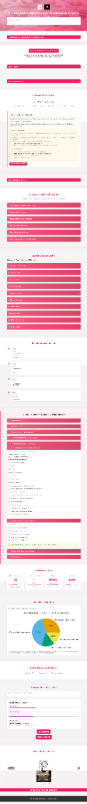

# Dashboard de Transformación Digital - Banquetes Primavera

## 🏗️ **Arquitectura del Proyecto**

Este proyecto es una aplicación web estática de alto rendimiento, construida siguiendo principios de diseño modular y "Vanilla" (sin frameworks pesados) para garantizar máxima velocidad, compatibilidad y facilidad de mantenimiento.

### **Tecnologías Core**
- **HTML5:** Marcado semántico y accesible.
- **CSS3:** Estilos personalizados con CSS Variables para theming (`style.css`), animaciones optimizadas (`animations.css`) y estilos específicos para visualización de datos (`charts.css`).
- **JavaScript (ES6+):** Lógica de negocio modular sin dependencias externas pesadas.

### **Estructura de Directorios**
```
/
├── index.html          # Punto de entrada principal
├── css/                # Capa de presentación
│   ├── style.css       # Estilos globales y layout
│   ├── charts.css      # Estilos para gráficos y visualización de datos
│   └── animations.css  # Definiciones de keyframes y transiciones
├── js/                 # Lógica de aplicación
│   ├── main.js         # Inicialización y lógica general
│   ├── charts.js       # Configuración y renderizado de gráficos (Chart.js)
│   ├── scroll-effects.js # Manejo de eventos de scroll y lazy loading
│   ├── animations.js   # Control de micro-interacciones
│   └── accordion-tests.js # Suite de pruebas para componentes interactivos
└── assets/             # Recursos estáticos (imágenes optimizadas)
```

### **Principios de Diseño**
1.  **Mobile-First:** Todos los estilos están diseñados pensando primero en dispositivos móviles y escalando a desktop.
2.  **Accesibilidad (a11y):** Implementación rigurosa de roles ARIA y navegación por teclado (Checklist verificable en `accordion-tests.js`).
3.  **Performance:** Uso de `loading="lazy"`, formatos de imagen modernos y minimización de bloqueos de renderizado.

## 🗺️ **Mapa del Sitio (Dashboard)**

El dashboard está estructurado como una Single Page Application (SPA) con navegación vertical basada en secciones colapsables (Accordions).



### **1. Cabecera (Header)**
*   **Logos:** Banquetes Primavera + Init Idea.
*   **Título:** Transformación Digital Integral.
*   **⚠️ Aviso Importante:** Disclaimer legal y metodología de análisis (Colapsable).

### **2. Módulos de Análisis Estratégico**
*   **🏛️ Estudio de Viabilidad - IMPI:** Análisis de registro marcario y estrategia (Clases 41/43).
*   **📊 Resumen Ejecutivo y Situación Actual:** Estado del proyecto y diagnóstico digital.
*   **⚔️ Análisis Competitivo:** Comparativa con competidores locales.
*   **🧠 Estrategia de Naming:** Semiótica y propuestas.
*   **📝 Información Requerida:** Checklist de activos pendientes.

### **3. Fases del Proyecto (Implementación)**
*   **Fase 1:** Identidad, Web y CRM.
*   **Fase 2:** Marketing Digital y Ecosistema.
*   **Fase 3:** Automatización e IA.

### **4. Cierre y Visualización**
*   **💬 Comentario Final:** Carta de presentación y valores de la propuesta.
*   **📈 Gráficos Interactivos:** Proyecciones de impacto y distribución presupuestal.
*   **👤 Resumen del Analista:** Conclusiones finales.

---

## ✅ **Mejoras Implementadas**

### **1. Reemplazo de Imágenes de Gráficos**
- ✅ `radaractualvsoperaciones.png` - Radar: Actual vs Objetivo (Operaciones)
- ✅ `compocision.png` - Composición Actual vs Potencial
- ✅ `radar.png` - Radar - Naming Estratégico
- ✅ `distribuciondeimpacto.png` - Distribución del Impacto Estratégico
- ✅ `mapadecalorcompetencias.png` - Mapa de Calor: Competidores Morelos

### **2. Descripciones Técnicas (Figcaptions)**
Cada gráfico incluye explicación técnica detallada según especificaciones.

### **3. Accesibilidad Mejorada**
- ✅ ARIA roles: `role="button"` en headers
- ✅ Estados ARIA: `aria-expanded`, `aria-controls`
- ✅ Navegación por teclado: `tabindex="0"`, eventos Enter/Space
- ✅ Targets táctiles: mínimo 44px según WCAG

### **4. Optimización Móvil**
- ✅ `loading="lazy"` en todas las imágenes
- ✅ `alt` descriptivos en imágenes
- ✅ Layout responsive sin scroll horizontal
- ✅ Touch targets optimizados

### **5. Corrección de Accordions Móviles**
- ❌ **PROBLEMA IDENTIFICADO**: `display: none` en `.analysis-content` rompía animación max-height
- ✅ **SOLUCIÓN**: Removido `display: none`, usando solo `max-height` + `opacity` para animación

---

## 🧪 **Pruebas Automáticas (Browser Console)**

### **Ejecutar Todos los Tests:**
```javascript
AccordionTests.runAll()
```

### **Tests Individuales:**
```javascript
AccordionTests.testHeaders()    // Verifica existencia de headers
AccordionTests.testAria()       // Valida atributos ARIA
AccordionTests.testClick()      // Prueba funcionalidad click
AccordionTests.testKeyboard()   // Prueba teclado Enter/Space
AccordionTests.testTouch()      // Valida touch targets
AccordionTests.testVisibility() // Verifica apertura/cierre
AccordionTests.testImages()     // Confirma carga de imágenes
AccordionTests.testCaptions()   // Valida presencia de figcaptions
```

---

## 📋 **Checklist de Verificación Manual**

### **Imágenes y Contenido**
- [ ] Las 5 imágenes nuevas están en `/assets/images/` con nombres exactos
- [ ] Todas las imágenes tienen `loading="lazy"` y `alt` descriptivos
- [ ] Cada gráfico tiene `<figcaption>` con descripción técnica estratégica
- [ ] Las imágenes se cargan correctamente en desktop y móvil

### **Accordions Desktop**
- [ ] Los 6 bloques colapsables responden al click
- [ ] La animación de apertura/cierre es suave (max-height + opacity)
- [ ] Los íconos rotan correctamente (+ ↻ -)
- [ ] Solo un bloque puede estar abierto a la vez

### **Accordions Móvil**
- [ ] Touch targets tienen mínimo 44px de altura
- [ ] Los bloques responden correctamente al toque
- [ ] No hay scroll horizontal en ningún breakpoint
- [ ] El contenido se despliega completamente al abrir

### **Accesibilidad**
- [ ] Todos los headers tienen `role="button"`
- [ ] Estados `aria-expanded` cambian correctamente
- [ ] Navegación por Tab funciona en todos los headers
- [ ] Enter y Space activan los accordions
- [ ] Focus outline es visible

### **Layout Responsive**
- [ ] Desktop: grids de 2 columnas funcionan
- [ ] Tablet: grids se adaptan a 1 columna
- [ ] Móvil: todos los elementos son usables
- [ ] No hay overflow horizontal en ningún tamaño

---

## 🛠️ **Comandos para Pruebas Lighthouse**

### **Chrome DevTools - Mobile Emulation**
```bash
# Abrir DevTools
F12 → Toggle device toolbar → Seleccionar iPhone/Pixel

# Ejecutar Lighthouse
DevTools → Lighthouse → Generate report (Mobile)
```

### **Objetivos de Performance**
- **Performance**: > 85
- **Accessibility**: > 90
- **Best Practices**: > 85
- **SEO**: > 90

### **Comandos de Consola para Debugging**
```javascript
// Verificar elementos del DOM
document.querySelectorAll('.analysis-header').length

// Verificar ARIA attributes
document.querySelector('.analysis-header').getAttribute('aria-expanded')

// Verificar touch targets
document.querySelector('.analysis-header').getBoundingClientRect()

// Verificar imágenes cargadas
document.querySelectorAll('img').forEach(img => console.log(img.complete))
```

---

## 🎯 **Estado Actual**

### **✅ COMPLETADO**
- Reemplazo de imágenes con nuevas versiones
- Figcaptions técnicos añadidos
- ARIA accessibility implementada
- Touch targets optimizados
- Animación max-height corregida
- Tests automáticos creados

### **🚧 PENDIENTE**
- Ejecutar tests en diferentes dispositivos
- Verificar Lighthouse scores
- Testing cross-browser (Safari, Firefox)

---

## 📱 **Instrucciones de Testing**

1. **Abrir el dashboard** en navegador
2. **Ejecutar tests** en consola: `AccordionTests.runAll()`
3. **Verificar manualmente** el checklist
4. **Probar en móvil** usando DevTools device toolbar
5. **Ejecutar Lighthouse** y verificar scores > 85

---

## 🔧 **Notas Técnicas**

- **Animación**: Solo usa `max-height` + `opacity`, NO `display: none`
- **Performance**: Imágenes con lazy loading y WebP recomendado
- **Accessibility**: Cumple WCAG 2.1 AA para accordions
- **Mobile**: Touch targets 44px+, no overflow horizontal

---

## 🚀 **Deploy Checklist**

- [ ] Tests pasan en todos los navegadores
- [ ] Lighthouse > 85 en todas las métricas
- [ ] Imágenes optimizadas (WebP/AVIF)
- [ ] CDN configurado para assets
- [ ] Cache headers apropiados

---

**Mensaje para Coach**: Updated charts with new images and figcaptions, improved accessible accordion with keyboard/touch support + mobile optimization, added accordion tests (browser console) and verification checklist.