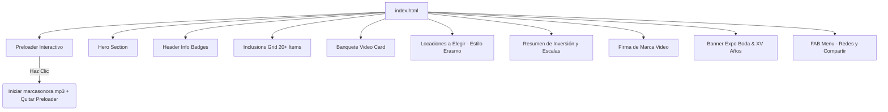

# 📖 Manual Definitivo de Cotizaciones Web Interactivas
> **Estándar de Excelencia y Desarrollo para Propuestas Digitales Premium**
> *Primavera Events Group · holding de alta gama corporativa y diseño de experiencias*

---

## 📑 Índice
1. [🏛️ Introducción y Filosofía de Diseño](#-introducción-y-filosofía-de-diseño)
2. [🎨 Identidad Visual y Manual de Estilo](#-identidad-visual-y-manual-de-estilo)
3. [🎵 Identidad Sonora y Preloader Interactivo](#-identidad-sonora-y-preloader-interactivo)
4. [📐 Estructura Técnica y Arquitectura del Código](#-estructura-técnica-y-arquitectura-del-código)
5. [🖥️ Componentes Premium Paso a Paso](#-componentes-premium-paso-a-paso)
   - [Preloader con Video e Interacción](#1-preloader-con-video-e-interacción)
   - [Hero y Encabezado con Caja de Resumen](#2-hero-y-encabezado-con-caja-de-resumen)
   - [Grid de Inclusiones Interactivas con Zoom](#3-grid-de-inclusiones-interactivas-con-zoom)
   - [Tarjeta de Buffet con Video Loop](#4-tarjeta-de-buffet-con-video-loop)
   - [Selector de Locaciones (Estilo Erasmo)](#5-selector-de-locaciones-estilo-erasmo)
   - [Resumen Financiero y Caja de Inversión Total](#6-resumen-financiero-y-caja-de-inversión-total)
   - [Firma Cinematográfica Interactiva](#7-firma-cinematográfica-interactiva)
   - [Publicidad Contextual Activa de la Expo Boda](#8-publicidad-contextual-activa-de-la-expo-boda)
   - [Botón Flotante de Acciones (FAB) y Compartir](#9-botón-flotante-de-acciones-fab-y-compartir)
6. [📱 Optimización Móvil y Buenas Prácticas SEO](#-optimización-móvil-y-buenas-prácticas-seo)
7. [🚀 Pauta de Despliegue y Mantenimiento](#-pauta-de-despliegue-y-mantenimiento)

---

## 🏛️ Introducción y Filosofía de Diseño

En el competitivo mercado de la organización de eventos y banquetes de gama alta, la primera impresión no es solo digital, es **emocional**. Las cotizaciones en papel o PDFs estáticos han quedado obsoletas. Primavera Events Group ha establecido un estándar de excelencia a través de **Propuestas Web Interactivas Premium** diseñadas para enamorar a los anfitriones desde el primer segundo.

Inspirado en la cotización de **Antonio**, este manual documenta la estructura conceptual, técnica y visual para crear cotizaciones interactivas inolvidables. La filosofía de diseño se sostiene sobre tres pilares:

1. **Inmersión Sensorial Completa**: Estimulación visual y auditiva sincronizada desde el inicio.
2. **Interactividad Fluida**: Animaciones fluidas no intrusivas basadas en micro-transiciones CSS, garantizando velocidad y respuesta táctil.
3. **Claridad Comercial**: Presentación transparente de inclusiones, escalas de precios y cotizaciones detalladas sin sorpresas ocultas.

> [!IMPORTANT]
> Cada cotización web es una extensión de la marca corporativa de **Primavera Events Group**. Se debe garantizar que la jerarquía visual muestre primero la marca paraguas y las marcas asociadas, y que el diseño sea impecable en todos los dispositivos móviles.

---

## 🎨 Identidad Visual y Manual de Estilo

Nuestra paleta de colores y tipografía deben aplicarse rigurosamente para mantener la uniformidad estética del holding de marcas.

### Paleta de Colores Oficiales

| Color | Hexadecimal | Uso y Aplicación |
| :--- | :--- | :--- |
| **Rosa Principal** | `#F65C7A` (o `#f05a7e`) | Color de acento primario, botones interactivos, iconos destacados y textos de llamada a la acción (CTA). |
| **Rosa Claro** | `#FF8FA3` (o `#f78da7`) | Tonos secundarios, degradados suaves, bordes activos y elementos destacados secundarios. |
| **Oro Noble** | `#C9A96E` | Bordes decorativos, elementos de lujo y acentos de gala tradicional. |
| **Negro Corporativo** | `#1F1F1F` | Fondos de secciones oscuras, títulos principales y textos de alto contraste. |
| **Rosa Soft** | `#FFF0F2` / `#FADADD` | Fondos de tarjetas ligeras, fondos alternos de tabla y sombreados suaves. |
| **Gris Textos** | `#6D6D6D` | Texto de cuerpo, descripciones, subtítulos secundarios y notas técnicas. |
| **Fondo Claro** | `#F8F6F4` | Fondo general de la página web (crema / arena suave). |

### Tipografía de Lujo
Para lograr un contraste sofisticado y premium, utilizamos una combinación de tipografías importadas de Google Fonts:

- **Títulos principales, subtítulos destacados y números grandes**: `Playfair Display` (Serif). Aporta nobleza, distinción clásica e impacto visual.
- **Cuerpo de texto, inclusiones, botones y navegación**: `Poppins` (Sans-serif, pesos 300, 400, 500, 600). Proporciona legibilidad excepcional en pantallas pequeñas y un aire moderno y tecnológico.

---

## 🎵 Identidad Sonora y Preloader Interactivo

El silencio digital es una oportunidad perdida. Una cotización premium de Primavera Events Group debe estar **musicalizada**. Para evitar las restricciones de reproducción automática impuestas por los navegadores modernos, se implementa un **Preloader Interactivo**.

### El Concepto del Preloader
El preloader no es una pantalla de carga estática; es un portal de entrada emocional.
- Presenta un video en bucle silenciado (`precarga.mp4?v=2.0`), que muestra una expectativa sutil del evento.
- Muestra una dedicatoria personalizada dirigida al cliente.
- Contiene un botón de llamada a la acción: **«Haz clic para continuar»**.
- Al interactuar con el botón, el usuario otorga el permiso de interacción requerido por el navegador. Esto desencadena:
  1. La reproducción de la **música de fondo** (`bgAudio` que reproduce `marcasonora.mp3` en bucle).
  2. La reproducción con sonido o sincronizada de los demás videos del documento.
  3. El desvanecimiento suave (`fade-out`) de la pantalla de bienvenida.

> [!TIP]
> La música de fondo debe reproducirse en bucle continuo y contar con un script robusto que evite las pausas accidentales causadas por interrupciones de foco del navegador.

---

## 📐 Estructura Técnica y Arquitectura del Código

Para garantizar un rendimiento sobresaliente, las propuestas se programan utilizando tecnologías nativas de alto rendimiento: **HTML5, Vanilla CSS y Javascript nativo (ES6)**. Se evita el uso de frameworks pesados que retrasen la carga móvil.



### Animaciones al Hacer Scroll (`IntersectionObserver`)
Para crear un efecto fluido y elegante, los elementos de la propuesta no aparecen de golpe. Se utiliza la clase `.reveal` que oculta el elemento y lo desplaza sutilmente hacia abajo o a los lados. Cuando el usuario se desplaza y el elemento entra en su pantalla, un `IntersectionObserver` de Javascript detecta la entrada y le añade la clase `.active`, activando una transición CSS fluida de opacidad y posición.

---

## 🖥️ Componentes Premium Paso a Paso

A continuación se detalla la especificación técnica y de diseño de cada uno de los componentes de nuestra plantilla maestra.

### 1. Preloader con Video e Interacción

El diseño del preloader utiliza un contenedor fijo que ocupa el 100% de la pantalla. El video se ajusta mediante `object-fit: cover` en móviles y `object-fit: contain` en pantallas anchas para evitar cortes indeseados.

```html
<!-- Estructura HTML del Preloader -->
<div id="preloader">
    <video id="preloaderVideo" autoplay muted loop playsinline preload="auto">
        <source src="precarga.mp4?v=2.0" type="video/mp4">
    </video>
    <div class="preloader-overlay">
        <p class="preloader-text">Estimado [Nombre del Cliente], gracias por considerarnos para la celebración de su gran día.</p>
        <button id="btnEnter" class="btn-enter">Haz clic para continuar</button>
    </div>
</div>

<audio id="bgAudio" loop preload="auto">
    <source src="marcasonora.mp3" type="audio/mpeg">
</audio>
```

```css
/* CSS de Alto Rendimiento para Preloader */
#preloader {
    position: fixed;
    top: 0;
    left: 0;
    width: 100%;
    height: 100%;
    background-color: var(--white);
    z-index: 9999;
    display: flex;
    align-items: center;
    justify-content: center;
    transition: opacity 0.8s ease, visibility 0.8s ease;
}
#preloader.fade-out {
    opacity: 0;
    visibility: hidden;
}
#preloader video {
    position: absolute;
    width: 100%;
    height: 100%;
    object-fit: cover;
    z-index: 1;
}
.preloader-overlay {
    position: absolute;
    bottom: 15%;
    left: 50%;
    transform: translateX(-50%);
    text-align: center;
    z-index: 10;
    width: 90%;
    max-width: 450px;
    background: rgba(255, 255, 255, 0.85);
    backdrop-filter: blur(10px);
    padding: 30px;
    border-radius: 24px;
    border: 1px solid var(--beige);
    box-shadow: 0 20px 40px rgba(0,0,0,0.15);
}
.preloader-text {
    color: var(--primary-dark);
    font-size: 1.05rem;
    margin-bottom: 20px;
    font-weight: 500;
    line-height: 1.5;
}
.btn-enter {
    background: var(--primary-pink);
    color: var(--white);
    border: none;
    padding: 14px 35px;
    border-radius: 30px;
    font-size: 1rem;
    font-weight: 600;
    cursor: pointer;
    box-shadow: 0 6px 20px rgba(246, 92, 122, 0.4);
    transition: all 0.3s cubic-bezier(0.25, 0.8, 0.25, 1);
}
.btn-enter:hover {
    transform: scale(1.05) translateY(-2px);
    box-shadow: 0 8px 25px rgba(246, 92, 122, 0.5);
    background: #e04b69;
}
```

```javascript
// Javascript para activar Audio y Transición
document.addEventListener('DOMContentLoaded', function() {
    var preloader = document.getElementById('preloader');
    var btnEnter = document.getElementById('btnEnter');
    var bgAudio = document.getElementById('bgAudio');
    
    btnEnter.addEventListener('click', function() {
        if (bgAudio) {
            bgAudio.play().catch(function(e) { console.log("Audio play error:", e); });
        }
        // Reproducir otros videos en la página
        ['videoMenu', 'videoFirma'].forEach(function(id) {
            var v = document.getElementById(id);
            if (v) { v.play().catch(function(){}); }
        });
        
        preloader.classList.add('fade-out');
        setTimeout(function() {
            preloader.style.display = 'none';
        }, 800);
    });
});
```

---

### 2. Hero y Encabezado con Caja de Resumen

La sección Hero muestra una gran portada visual de alto impacto con un degradado oscuro que garantiza la legibilidad del título. Justo debajo, la caja de resumen se superpone sobre el hero en computadoras de escritorio y se reorganiza de manera adaptativa en móviles.

```html
<!-- Hero & Header Info -->
<header class="hero">
    <div class="hero-content">
        <h1>Propuesta Exclusiva</h1>
        <p>XV Años · [Mes] [Año]</p>
    </div>
</header>

<main class="container">
    <div class="quote-card">
        <div class="header-info reveal">
            <div class="header-main">
                <h2>Celebración de XV Años</h2>
                <p>Estimado <strong>[Nombre del Cliente]</strong>, hemos diseñado una experiencia culinaria y de celebración única para hacer de su evento un recuerdo eterno con capacidad para <strong>[Número] personas</strong>.</p>
                <span class="badge-anniversary"><i class="fa-solid fa-star"></i> Propuesta de Gala VIP</span>
            </div>
            <div class="summary-boxes">
                <div class="info-box"><span>Invitados</span><strong>[Número] Pers.</strong></div>
                <div class="info-box"><span>Inversión</span><strong>$[Precio] p/p</strong></div>
                <div class="info-box"><span>Fecha</span><strong>[Fecha]</strong></div>
            </div>
        </div>
```

```css
/* Estilos del Hero y Tarjeta Superpuesta */
.hero {
    position: relative;
    height: 60vh;
    min-height: 400px;
    background-image: url('hero.png');
    background-size: cover;
    background-position: center;
    background-attachment: scroll;
    display: flex;
    justify-content: center;
    align-items: center;
}
.hero::before {
    content: '';
    position: absolute;
    top: 0; left: 0; right: 0; bottom: 0;
    background: linear-gradient(to bottom, rgba(0,0,0,0.25), rgba(0,0,0,0.6));
}
.hero-content {
    position: relative;
    text-align: center;
    color: var(--white);
    z-index: 1;
    padding: 0 20px;
    margin-top: -50px;
}
.hero h1 {
    font-size: 3.8rem;
    font-weight: 700;
    text-shadow: 0 4px 15px rgba(0,0,0,0.6);
    margin-bottom: 10px;
}
.hero p {
    font-family: 'Poppins', sans-serif;
    font-size: 1.1rem;
    font-weight: 300;
    letter-spacing: 5px;
    text-transform: uppercase;
    color: var(--primary-light);
}
.container {
    max-width: 1100px;
    margin: -80px auto 60px;
    position: relative;
    z-index: 2;
    padding: 0 20px;
}
.quote-card {
    background: var(--white);
    border-radius: 32px;
    box-shadow: 0 30px 60px rgba(0,0,0,0.08);
    padding: 55px;
}
.header-info {
    display: flex;
    justify-content: space-between;
    align-items: flex-start;
    border-bottom: 1px solid var(--beige);
    padding-bottom: 40px;
    margin-bottom: 45px;
    flex-wrap: wrap;
    gap: 30px;
}
.header-main {
    flex: 1;
    min-width: 300px;
}
.header-main h2 {
    font-size: 2.8rem;
    color: var(--primary-dark);
    margin-bottom: 15px;
    line-height: 1.2;
}
.badge-anniversary {
    display: inline-block;
    background: var(--soft-pink);
    color: var(--primary-pink);
    padding: 8px 20px;
    border-radius: 30px;
    font-size: 0.85rem;
    font-weight: 600;
    margin-top: 15px;
    text-transform: uppercase;
    letter-spacing: 1.5px;
}
.summary-boxes {
    display: flex;
    gap: 15px;
    flex-wrap: wrap;
}
.info-box {
    text-align: center;
    background: var(--background-light);
    padding: 20px 25px;
    border-radius: 20px;
    border: 1px solid var(--beige);
    min-width: 120px;
    flex-grow: 1;
}
.info-box span {
    display: block;
    font-size: 0.75rem;
    color: var(--gray-text);
    text-transform: uppercase;
    letter-spacing: 1.2px;
    font-weight: 700;
    margin-bottom: 6px;
}
.info-box strong {
    display: block;
    font-size: 1.35rem;
    color: var(--primary-dark);
    font-family: 'Playfair Display', serif;
}
```

---

### 3. Grid de Inclusiones Interactivas con Zoom

Cada inclusión de servicio interactivo se diseña dentro de una rejilla dinámica. Las imágenes tienen un contenedor con desbordamiento oculto (`overflow: hidden`), lo que permite que la imagen realice un efecto de zoom suave al pasar el cursor sobre la tarjeta.

```html
<!-- Grid de Inclusiones -->
<h3 class="section-title reveal"><i class="fa-solid fa-gem"></i> Nuestra Propuesta Integral</h3>
<div class="includes-grid">
    <div class="reveal">
        <div class="include-item">
            <div class="include-img-container">
                
            </div>
            <div class="include-content">
                <h4><i class="fa-solid fa-chair"></i> Mobiliario de Vanguardia</h4>
                <p>Montajes elegantes a elegir con sillas Crossback, Tiffany, Lotus o Boss combinadas con mesas de madera o mármol.</p>
            </div>
        </div>
    </div>
    <!-- Repetir estructuras similares para las 20 inclusiones clave -->
</div>
```

```css
/* CSS de Inclusiones con Micro-Animaciones */
.section-title {
    color: var(--primary-dark);
    font-size: 1.8rem;
    margin: 50px 0 35px;
    display: flex;
    align-items: center;
    gap: 15px;
}
.section-title i {
    color: var(--primary-pink);
}
.includes-grid {
    display: grid;
    grid-template-columns: repeat(auto-fit, minmax(300px, 1fr));
    gap: 25px;
    margin-bottom: 50px;
}
.include-item {
    background: var(--white);
    border: 1px solid var(--beige);
    border-radius: 20px;
    overflow: hidden;
    height: 100%;
    display: flex;
    flex-direction: column;
    transition: all 0.4s cubic-bezier(0.165, 0.84, 0.44, 1);
}
.include-item:hover {
    transform: translateY(-6px);
    box-shadow: 0 15px 30px rgba(0,0,0,0.06);
    border-color: var(--primary-pink);
}
.include-img-container {
    width: 100%;
    height: 200px;
    overflow: hidden;
    position: relative;
}
.include-img {
    width: 100%;
    height: 100%;
    object-fit: cover;
    transition: transform 0.6s cubic-bezier(0.165, 0.84, 0.44, 1);
}
.include-item:hover .include-img {
    transform: scale(1.08);
}
.include-content {
    padding: 25px;
    flex-grow: 1;
}
.include-content h4 {
    font-size: 1.15rem;
    font-weight: 600;
    margin-bottom: 10px;
    color: var(--primary-dark);
    display: flex;
    align-items: center;
    gap: 8px;
}
.include-content h4 i {
    color: var(--primary-pink);
    font-size: 1rem;
}
.include-content p {
    font-size: 0.9rem;
    color: var(--gray-text);
    line-height: 1.5;
}
```

---

### 4. Tarjeta de Buffet con Video Loop

Para destacar la experiencia culinaria (como la barra de pastas, pizza artesanal, taquizas o buffet de cortes), se utiliza una tarjeta de ancho completo que incorpora un video en bucle sin sonido en el lateral izquierdo y una lista detallada de inclusiones con un botón CTA de menú a la derecha.

```html
<!-- Banquete Reveal con Video lateral -->
<div class="reveal" id="banqueteReveal" style="margin-bottom: 50px;">
    <div class="include-item" style="display: flex; flex-direction: row; flex-wrap: wrap;">
        <div class="include-img-container" style="flex: 1; min-width: 300px; height: auto; min-height: 280px;">
            <video id="videoMenu" autoplay muted loop playsinline preload="auto" style="width: 100%; height: 100%; object-fit: cover; display: block;">
                <source src="menu_antonio.mp4?v=2.0" type="video/mp4">
            </video>
        </div>
        <div class="include-content" style="flex: 1.2; min-width: 300px; padding: 35px; display: flex; flex-direction: column; justify-content: center;">
            <h4 style="font-size: 1.4rem;"><i class="fa-solid fa-utensils"></i> Banquete y Barra Gastronómica Interactiva</h4>
            <p style="margin-bottom: 15px;">Disfrute de una propuesta culinaria moderna y espectacular servida en estaciones temáticas de autor:</p>
            <ul style="list-style: none; padding-left: 0; margin-bottom: 25px;">
                <li style="margin-bottom: 8px; font-size: 0.95rem; color: var(--gray-text);"><i class="fa-solid fa-check" style="color: var(--primary-pink); margin-right: 8px;"></i> Barra interactiva de pastas finas</li>
                <li style="margin-bottom: 8px; font-size: 0.95rem; color: var(--gray-text);"><i class="fa-solid fa-check" style="color: var(--primary-pink); margin-right: 8px;"></i> Pizza artesanal crujiente hecha al horno en vivo</li>
                <li style="margin-bottom: 8px; font-size: 0.95rem; color: var(--gray-text);"><i class="fa-solid fa-check" style="color: var(--primary-pink); margin-right: 8px;"></i> Esquites tradicionales y estación de snacks</li>
                <li style="margin-bottom: 8px; font-size: 0.95rem; color: var(--gray-text);"><i class="fa-solid fa-check" style="color: var(--primary-pink); margin-right: 8px;"></i> Menú de tornafiesta a elegir (chilaquiles o esquites)</li>
            </ul>
            <a href="https://primaveraeventsgroup.com/nuestros-menus/" class="btn-enter" style="align-self: flex-start; text-decoration: none; text-align: center;" target="_blank">
                Explora el catálogo de menús <i class="fa-solid fa-arrow-right" style="margin-left: 8px;"></i>
            </a>
        </div>
    </div>
</div>
```

---

### 5. Selector de Locaciones (Estilo Erasmo)

Este componente interactivo es vital para clientes indecisos o cotizaciones premium multi-recinto. Presenta un grid de locaciones disponibles que incluye las locaciones insignia de la marca (como el Centro de Convenciones Presidente, Rancho Los Potrillos, Salón Los Caballos, Jardín La Flor, Salón Jardín Yolomecatl, y las dos locaciones premium exclusivas: **Villa Di Fiori** y **Salón Solaire**).

```html
<!-- Locaciones Disponibles -->
<div class="locations-section">
    <h3 class="section-title reveal"><i class="fa-solid fa-map-location-dot"></i> Recintos y Locaciones Disponibles</h3>
    <p style="text-align: center; color: var(--gray-text); margin-bottom: 30px;" class="reveal">Haga clic en cualquiera de nuestras locaciones exclusivas para ver fotos y mapas:</p>
    <div class="locations-grid">
        <a href="https://primaveraeventsgroup.com/venues/villa-di-fiori/" class="location-btn reveal reveal-left delay-1" target="_blank">
            <span class="click-label"><i class="fa-solid fa-eye"></i> Conocer Locación</span>
            
            <div class="location-name">Villa Di Fiori (Premium)</div>
        </a>
        <a href="https://primaveraeventsgroup.com/venues/solaire/" class="location-btn reveal reveal-right delay-2" target="_blank">
            <span class="click-label"><i class="fa-solid fa-eye"></i> Conocer Locación</span>
            
            <div class="location-name">Jardín & Salón Solaire (Exclusivo)</div>
        </a>
        <!-- Otros recintos del grupo -->
    </div>
</div>
```

```css
/* CSS del Selector de Locaciones */
.locations-section {
    margin-top: 50px;
    padding-top: 40px;
    border-top: 1px solid var(--beige);
}
.locations-grid {
    display: grid;
    grid-template-columns: repeat(auto-fit, minmax(220px, 1fr));
    gap: 20px;
    margin-top: 20px;
}
.location-btn {
    position: relative;
    display: flex;
    flex-direction: column;
    background: var(--white);
    border: 1px solid rgba(0,0,0,0.04);
    border-radius: 24px;
    overflow: hidden;
    transition: all 0.4s cubic-bezier(0.165, 0.84, 0.44, 1);
    text-decoration: none;
    color: var(--primary-dark);
    box-shadow: 0 10px 25px rgba(0,0,0,0.02);
}
.location-btn:hover {
    transform: translateY(-8px);
    box-shadow: 0 15px 35px rgba(0,0,0,0.08);
    border-color: var(--primary-pink);
}
.location-img {
    width: 100%;
    height: 240px;
    object-fit: cover;
    transition: transform 0.6s ease;
}
.location-btn:hover .location-img {
    transform: scale(1.06);
}
.location-name {
    padding: 15px;
    font-weight: 600;
    font-size: 1.05rem;
    text-align: center;
    font-family: 'Playfair Display', serif;
    background: var(--white);
}
.click-label {
    position: absolute;
    top: 12px;
    right: 12px;
    background: var(--primary-pink);
    color: var(--white);
    padding: 5px 12px;
    border-radius: 20px;
    font-size: 0.7rem;
    font-weight: 600;
    box-shadow: 0 4px 10px rgba(0, 0, 0, 0.15);
    z-index: 5;
    transition: background 0.3s;
}
.location-btn:hover .click-label {
    background: #e04b69;
}
```

---

### 6. Resumen Financiero y Caja de Inversión Total

Presenta la inversión por persona de forma detallada y muestra una caja final destacada con el cálculo matemático exacto del monto total de inversión del evento.

```html
<!-- Tabla de Precios -->
<div class="pricing-section reveal">
    <h3 class="section-title" style="margin-top:0;"><i class="fa-solid fa-receipt"></i> Resumen de Inversión</h3>
    <table class="pricing-table">
        <thead>
            <tr>
                <th>Concepto de Servicio</th>
                <th style="text-align:right;">Costo por Persona</th>
            </tr>
        </thead>
        <tbody>
            <tr>
                <td>
                    <span class="item-main">Servicio de Banquete & Coordinación Premium</span>
                    <span class="item-sub">Incluye la totalidad de las 20 inclusiones descritas, staff de meseros y DJ profesional.</span>
                </td>
                <td class="price-val">$[Precio] <span style="font-size:0.9rem; color:var(--gray-text);">p/p</span></td>
            </tr>
        </tbody>
    </table>
    <div class="total-box">
        <div class="total-label">Inversión Total Estimada ([Número] personas)</div>
        <div class="total-amount">$[Monto Total] MXN</div>
    </div>
</div>
```

```css
/* CSS de Tabla de Precios y Totalización */
.pricing-section {
    background: var(--background-light);
    border-radius: 24px;
    padding: 40px;
    margin-top: 50px;
    border: 1px solid var(--beige);
}
.pricing-table {
    width: 100%;
    border-collapse: collapse;
}
.pricing-table th {
    text-align: left;
    padding: 15px;
    color: var(--gray-text);
    font-size: 0.8rem;
    text-transform: uppercase;
    letter-spacing: 1.5px;
    border-bottom: 2px solid var(--beige);
}
.pricing-table td {
    padding: 25px 15px;
    border-bottom: 1px solid var(--beige);
}
.item-main {
    font-weight: 600;
    font-size: 1.25rem;
    display: block;
    color: var(--primary-dark);
}
.item-sub {
    font-size: 0.85rem;
    color: var(--gray-text);
    margin-top: 4px;
    display: block;
}
.price-val {
    font-family: 'Playfair Display', serif;
    font-size: 1.85rem;
    font-weight: 700;
    color: var(--primary-pink);
    text-align: right;
    white-space: nowrap;
}
.total-box {
    margin-top: 30px;
    padding-top: 30px;
    border-top: 2px solid var(--beige);
    display: flex;
    justify-content: space-between;
    align-items: center;
    flex-wrap: wrap;
    gap: 15px;
}
.total-label {
    font-size: 1.15rem;
    font-weight: 600;
    color: var(--primary-dark);
}
.total-amount {
    font-family: 'Playfair Display', serif;
    font-size: 2.5rem;
    font-weight: 700;
    color: var(--primary-pink);
}
```

---

### 7. Firma Cinematográfica Interactiva

Al final de la propuesta, incorporamos un video de firma corporativa (`firma.mp4?v=3.0`) en bucle de 2-3 segundos. Se le aplica la propiedad CSS `mix-blend-mode: multiply` para fundir perfectamente el fondo del video con el fondo de la página, logrando un acabado elegante de firma digitalizada real sobre papel.

```html
<!-- Firma Digital -->
<div class="signature-section reveal">
    <video id="videoFirma" autoplay muted loop playsinline preload="auto" style="max-width: 250px; width: 100%; height: auto; mix-blend-mode: multiply;">
        <source src="firma.mp4?v=3.0" type="video/mp4">
    </video>
    <p style="font-size: 0.8rem; color: var(--gray-text); margin-top: 8px;">Firma de Autorización · Primavera Events Group</p>
</div>
```

```css
.signature-section {
    text-align: center;
    margin: 40px auto 20px;
}
```

---

### 8. Publicidad Contextual Activa de la Expo Boda

Para aprovechar el tráfico de clientes y generar tracción hacia el gran evento de proveedores de la temporada, integramos un banner sofisticado sobre la **Expo Boda y 15 Años** en el Centro de Convenciones Presidente. Utiliza un fondo oscuro refinado con degradado y tipografías en oro y rosa.

```html
<!-- Publicidad de la Expo Boda -->
<div class="expo-section reveal">
    <div class="expo-card">
        <div class="expo-content">
            <span class="expo-badge">Evento Patrocinado Especial</span>
            <h3>¡Visítanos en la gran Expo Boda & XV Años!</h3>
            <p>Descubra tendencias, deguste menús de gala en vivo y obtenga promociones únicas registrándose hoy mismo de forma gratuita. Próximo [Fecha] en el Centro de Convenciones Presidente.</p>
            <a href="https://primaveraeventsgroup.com/expo-boda-y-quince-anos-centro-de-convenciones-presidente/" class="btn-expo" target="_blank">
                Obtener Pase Gratuito <i class="fa-solid fa-arrow-right"></i>
            </a>
        </div>
        <div class="expo-img-box">
            
        </div>
    </div>
</div>
```

```css
/* Estilos Publicitarios Premium */
.expo-section {
    margin-top: 60px;
}
.expo-card {
    background: linear-gradient(135deg, #1A1A1A 0%, #333333 100%);
    border-radius: 24px;
    display: flex;
    overflow: hidden;
    color: var(--white);
    box-shadow: 0 15px 35px rgba(0,0,0,0.18);
    align-items: stretch;
    flex-wrap: wrap;
}
.expo-content {
    padding: 40px;
    flex: 1.2;
    min-width: 280px;
}
.expo-badge {
    background: var(--primary-pink);
    padding: 6px 14px;
    border-radius: 50px;
    font-size: 0.75rem;
    text-transform: uppercase;
    font-weight: 600;
    letter-spacing: 1.2px;
    display: inline-block;
    margin-bottom: 15px;
}
.expo-content h3 {
    font-size: 1.85rem;
    margin-bottom: 12px;
    line-height: 1.3;
}
.expo-content p {
    color: #CCCCCC;
    margin-bottom: 25px;
    font-size: 0.95rem;
}
.btn-expo {
    background: var(--white);
    color: var(--primary-dark);
    padding: 12px 25px;
    border-radius: 30px;
    text-decoration: none;
    display: inline-flex;
    align-items: center;
    gap: 8px;
    font-weight: 600;
    transition: all 0.3s ease;
    font-size: 0.9rem;
}
.btn-expo:hover {
    background: var(--primary-pink);
    color: var(--white);
    transform: translateY(-2px);
}
.expo-img-box {
    flex: 1;
    min-width: 280px;
    overflow: hidden;
}
.expo-img-box img {
    width: 100%;
    height: 100%;
    object-fit: cover;
    transition: transform 0.8s ease;
}
.expo-card:hover .expo-img-box img {
    transform: scale(1.05);
}
```

---

### 9. Botón Flotante de Acciones (FAB) y Compartir

Este componente flotante premium facilita la interacción social y el guardado de la propuesta. El botón principal (un icono elegante de pulgar arriba) se despliega en abanico al hacer clic mostrando las cinco redes sociales oficiales. El botón de compartir activa la API nativa de compartición móvil de los navegadores.

```html
<!-- Floating Action Buttons -->
<div class="floating-actions-container">
    <div class="fab-group" id="socialGroup">
        <div class="fab-menu">
            <a href="https://facebook.com/share/1GLd3Qt2Tj" target="_blank" class="fab-item" title="Facebook"><i class="fa-brands fa-facebook-f"></i></a>
            <a href="https://instagram.com/primavera.events.group" target="_blank" class="fab-item" title="Instagram"><i class="fa-brands fa-instagram"></i></a>
            <a href="https://tiktok.com/@primavera_events_group" target="_blank" class="fab-item" title="TikTok"><i class="fa-brands fa-tiktok"></i></a>
            <a href="https://linkedin.com/in/richard-hernandez-3844ba3b9" target="_blank" class="fab-item" title="LinkedIn"><i class="fa-brands fa-linkedin-in"></i></a>
            <a href="https://www.youtube.com/@PrimaveraEventsGroup" target="_blank" class="fab-item" title="YouTube"><i class="fa-brands fa-youtube"></i></a>
        </div>
        <button class="fab-main fab-social" id="btnSocial">
            <span class="fab-label">Nuestras Redes</span>
            <i class="fa-solid fa-thumbs-up"></i>
        </button>
    </div>
    <button class="fab-main fab-share" id="btnShare" title="Compartir Propuesta">
        <span class="fab-label">Compartir Propuesta</span>
        <i class="fa-solid fa-share-nodes"></i>
    </button>
</div>
```

```css
/* CSS del Menú de Acciones Flotante */
.floating-actions-container {
    position: fixed;
    bottom: 20px;
    right: 20px;
    z-index: 1000;
    display: flex;
    flex-direction: column;
    align-items: flex-end;
    gap: 12px;
}
.fab-group {
    display: flex;
    flex-direction: column;
    align-items: flex-end;
    position: relative;
}
.fab-main {
    width: 48px;
    height: 48px;
    border-radius: 50%;
    background: var(--white);
    border: 1px solid var(--beige);
    color: var(--primary-pink);
    font-size: 1.3rem;
    cursor: pointer;
    display: flex;
    align-items: center;
    justify-content: center;
    position: relative;
    transition: all 0.4s cubic-bezier(0.175, 0.885, 0.32, 1.25);
    box-shadow: 0 4px 15px rgba(0,0,0,0.06);
    z-index: 2;
}
.fab-main:hover {
    transform: scale(1.08) translateY(-2px);
    border-color: var(--primary-pink);
}
.fab-label {
    position: absolute;
    right: 60px;
    background: var(--white);
    color: var(--primary-dark);
    padding: 6px 12px;
    border-radius: 15px;
    font-size: 0.75rem;
    white-space: nowrap;
    box-shadow: 0 4px 10px rgba(0,0,0,0.05);
    opacity: 0;
    visibility: hidden;
    transition: all 0.3s ease;
    font-weight: 500;
    pointer-events: none;
    border: 1px solid var(--beige);
}
.fab-main:hover .fab-label {
    opacity: 1;
    visibility: visible;
    right: 55px;
}
.fab-menu {
    display: flex;
    flex-direction: column-reverse;
    gap: 8px;
    position: absolute;
    bottom: 100%;
    right: 4px;
    opacity: 0;
    visibility: hidden;
    transform: translateY(15px);
    transition: all 0.4s cubic-bezier(0.175, 0.885, 0.32, 1.25);
    margin-bottom: 8px;
    pointer-events: none;
    z-index: 1;
}
.fab-group.active .fab-menu {
    opacity: 1;
    visibility: visible;
    transform: translateY(0);
    pointer-events: auto;
}
.fab-item {
    width: 38px;
    height: 38px;
    border-radius: 50%;
    background: var(--white);
    color: var(--primary-pink);
    display: flex;
    align-items: center;
    justify-content: center;
    text-decoration: none;
    font-size: 1.05rem;
    box-shadow: 0 4px 10px rgba(0,0,0,0.05);
    transition: all 0.3s ease;
    border: 1px solid var(--beige);
}
.fab-item:hover {
    background: var(--primary-pink);
    color: var(--white);
    transform: scale(1.1);
}
.fab-group.active .fab-main {
    transform: rotate(15deg) scale(0.95);
    background: var(--primary-pink);
    color: var(--white);
}
```

```javascript
// Script de Control e Compartición Web API
document.addEventListener('DOMContentLoaded', function() {
    var fabSocial = document.getElementById('socialGroup');
    var btnSocial = document.getElementById('btnSocial');
    
    btnSocial.addEventListener('click', function(e) {
        e.stopPropagation();
        fabSocial.classList.toggle('active');
    });
    
    document.addEventListener('click', function() {
        fabSocial.classList.remove('active');
    });
    
    var btnShare = document.getElementById('btnShare');
    var shareData = {
        title: 'Propuesta Personalizada - Primavera Events Group',
        text: 'Te comparto la propuesta web interactiva que diseñó Primavera Events Group para la celebración de nuestro evento.',
        url: window.location.href
    };
    
    btnShare.addEventListener('click', async function() {
        if (navigator.share) {
            try {
                await navigator.share(shareData);
            } catch (err) {
                if (err.name !== 'AbortError') { console.error(err); }
            }
        } else {
            try {
                await navigator.clipboard.writeText(window.location.href);
                alert('¡Enlace de propuesta copiado al portapapeles! Ya puede pegarlo y compartirlo en WhatsApp.');
            } catch (err) {
                alert('Por favor, copie la dirección URL directamente de la barra de su navegador.');
            }
        }
    });
});
```

---

## 📱 Optimización Móvil y Buenas Prácticas SEO

Las cotizaciones son consultadas por los clientes principalmente en **teléfonos móviles** (a menudo mientras viajan o discuten los preparativos). La plantilla debe estar optimizada al 100% para dispositivos móviles.

### Reglas de Diseño Responsivo
1. **Vídeos adaptables**: Los vídeos en móviles nunca deben forzar la barra de desplazamiento horizontal. Utilice `width: 100%; height: auto; max-width: 100%`.
2. **Tablas con Scroll**: Para las tablas de precios, en pantallas menores a 600px aplique un contenedor `.pricing-section { overflow-x: auto; }` para que la tabla sea deslizable lateralmente, o reestructure las celdas en bloques mediante CSS `display: block`.
3. **Imágenes Ligeras**: Comprima todas las imágenes en formato `.webp` de alta definición y active la carga diferida (`loading="lazy"`).
4. **Espacios y Padding**: En pantallas pequeñas, reduzca los rellenos (`padding`) de la tarjeta principal a `30px 15px` para maximizar el área de lectura del cuerpo.

### Optimización de Rendimiento y SEO
Toda cotización web debe cumplir con las mejores prácticas de velocidad de carga y rastreo para proteger la reputación digital del holding:
- **Title único**: `<title>Cotización Premium: [Nombre del Cliente] | Primavera Events Group</title>`
- **Meta Description llamativa**: `<meta name="description" content="Propuesta exclusiva y personalizada para la celebración de [Evento] de [Cliente]. Servicios integrales de banquetes en Morelos.">`
- **Etiquetas Semánticas**: Uso estricto de un único `<h1>` en el Hero, `<h2>` para el título de la cotización y `<h3>` para cada bloque seccional.
- **IDs únicos**: Asigne IDs descriptivos a todos los botones interactivos, lo que facilitará futuras pruebas de usuario y análisis de analítica digital.

---

## 🚀 Pauta de Despliegue y Mantenimiento

Al desplegar una nueva cotización interactiva para un cliente:

1. **Crear una rama o directorio dedicado** en el repositorio del holding con el formato del cliente (ej. `antonio-cotizacion`).
2. **Copiar los recursos multimedia locales** (videos de precarga y firma, imágenes de los platillos seleccionados) y optimizarlos para compresión web.
3. **Personalizar las constantes** de texto (nombre, fecha, número de personas, precios específicos y enlaces de WhatsApp) en el archivo `index.html`.
4. **Realizar una prueba de audio y video**: Abra el enlace web final en un dispositivo iOS y Android para asegurar que los videos en bucle se inicien sin contratiempos y el preloader funcione de manera fluida.

---
*Primavera Events Group · Creando recuerdos inolvidables en Morelos*
